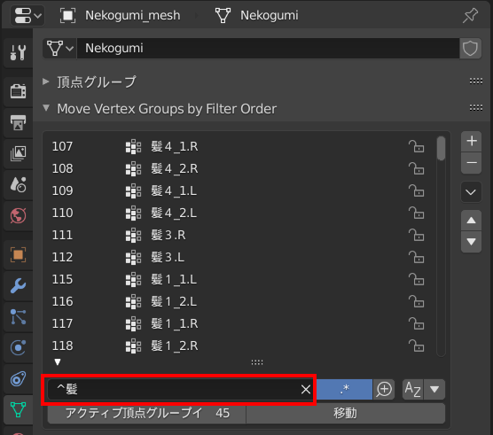

# Move Vertex Groups by Filter Order

## Description

「Move Vertex Groups by Filter Order」は、Blenderのアドオンです。
複数の頂点グループを一度に移動するためのパネルをプロパティのデータに追加します。
2.79bおよび、2.8x以降に対応しています。


## Download

画面右上にある［Code ▼］ ＞ ［Dwonload ZIP］の順にクリックして、ZIPファイルをダウンロードしてください。


## Install

1. Blenderの［Blenderプリファレンス］画面を開きます。
1. ［アドオン］タブにある［インストール］ボタンを押して、ダウンロードしたZIPファイルを選択しインストールします。
1. ［サポートレベル］にある［テスト中］を押して、テスト中のアドオンを表示します。
1. ［Move Vertex Groups by Filter Order］の左にあるチェックをつけて、アドオンを有効にします。


## Caution

一度に50個以上の頂点グループを並び替えすると、Blenderがビジー状態になることがあります。
Blenderがビジー状態になったときは、しばらく待ってみてください。
なるべく少ない件数でフィルタリングを行い、並べ替え(移動す)るようにしてください。

## Usage

オブジェクトを選択した状態で、［プロパティ］ > ［データ］を見ると、［Move Vertex Groups by Filter Order］パネルが追加されています。

［頂点グループ］パネルと同じ見た目ですが、パネルの［▼］(フィルタリングオプションを表示します)ボタンを押してフィルタリングオプションを表示すると、［.*］(正規表現でフィルターする)ボタンと、［移動］ボタンが追加されていることがわかります。


このアドオンは、頂点グループを名前や正規表現などでフィルタリングした結果を、アクティブな頂点グループの位置に移動することができます。

### 1.フィルタリングして項目を抽出する

複数の項目を一度に移動するには、移動したい項目を抽出する必要があります。
［名前でフィルタ］ボックスに、抽出したい頂点グループの名前を入力すると、ボックスに入力した名前をもつすべての頂点グループが抽出されます。

ここでは、「髪３.」と入力しました。リストには「髪３.」と名前のついた頂点グループがすべて抽出されています。


名前のみの条件では余計な項目まで抽出されてしまうことがあります。そのようなときは、名前の検索に記号を用いることで、抽出する条件を指定することができます。

Blenderの標準の機能では、ワイルドカードの「*」の記号が使用できます。

本アドオンの機能では、［.*］(正規表現でフィルターする)を有効すると、正規表現でフィルタリングすることができます。詳しくは「[正規表現を使って項目を抽出する](#正規表現を使って項目を抽出する)」を参照してください。

### 2.項目をソートする

頂点グループの並び順がバラバラなときには、［アイテムを名前でソート］を有効にすることで、リスト内の項目を名前順に並べ替えることができます。


また、［反転］を有効にするとリスト内の項目を逆の順番に並べ替えることもできます。

### 3.アクティブ頂点グループインデックスで移動先を指定する

並び替えたい項目を抽出したら、アクティブ頂点グループインデックスで移動先を指定します。
アクティブ頂点グループインデックスとは、［頂点グループ］パネルで選択中の頂点グループの位置のことです。
番号を直接指定しても良いですが、［頂点グループ］パネルで移動したい項目の位置を選択すると楽です。


### 4.移動する

［移動］ボタンを押すと、アクティブ頂点グループインデックスの位置に抽出した項目を移動できます。


※一度に移動する項目が多いと処理に時間がかかり、Blenderがビジー状態になることがありますので注意してください。

## 正規表現を使って項目を抽出する

いくつか正規表現の入力例を紹介します。
実際に使用するときには検索したい頂点グループの名前に置き換えるなどしてください。
半角と全角は区別されますので、数字などの入力の際にはお気をつけください。

参考:[基本的な正規表現一覧](https://murashun.jp/blog/20190215-01.html)
参考:[6.2.1.正規表現のシンタックス](https://docs.python.org/ja/3.5/library/re.html#regular-expression-syntax)


### 任意の数字を指定する

「\d」は「0～9」の数字にあてはまります。

#### 正規表現の入力例


```
ｽｶｰﾄ1_\d
```


```
ｽｶｰﾄ\d_\d
```


### 文字列の末尾を指定する

文字列や数字の指定のみでは「ｽｶｰﾄ1_3先」や「ｽｶｰﾄ2_1.L」や「ｽｶｰﾄ2_1.R」といった、数値に文字列が続く名前も抽出されてしまいます。このようなときは、文字列の末尾を示すように「$」を入力します。

#### 正規表現の入力例

```
ｽｶｰﾄ1_\d$
```


### 数字の桁数を指定する

連番の桁数の分だけ「\d」を増やすか、「{n}」で桁数を指定します。

#### 正規表現の入力例

```
しっぽ\d\d
```


```
しっぽ\d{2}
```


### 特定の１文字を指定する
正規表現では「.」は任意の一文字として扱われますが、Blenderでは区切り文字として使われているため、区切り文字として抽出したい場合には文字を「[]」で囲うことで認識されるようになります。
また、「[P,C]」などとすることで複数の特定のアルファベットを指定することもできます。

#### 正規表現の入力例

```
肩[.]
```


```
肩[P,C]
```


### 先頭の文字を指定する

「髪」と入力しただけだと、「前髪」も「髪」も両方抽出されてしまいます。
そのようなときは、文字列の先頭を示すように「^」を入力します。


#### 正規表現の入力例

```
^髪
```




### 任意の１文字を指定する

数字やアルファベットなどを文字を区別する必要がなく、文字数のみで抽出したい場合には「.」を指定します。


#### 正規表現の入力例

```
^髪....$
```


## Licence

[MIT License](./LICENCE)

## Author

GitHub:[Samia](https://github.com/samia_done)  
Twitter:[@samia_done](https://twitter.com/samia_done)
